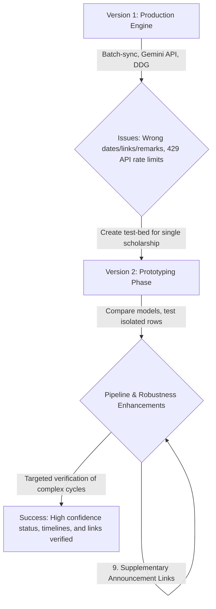

# Scholarship Scout: System Evolution & Logic History

This document chronicles the development of the automated scholarship scouting and verification system from the very first production implementation to the current resilient testing prototype.

---

## 🛠️ The Architecture Evolution

---

## 📅 Version 1: Batch-Sync Production Engine ([runner.py](file:///c:/Work/schreminder/src/runner.py), [scout.py](file:///c:/Work/schreminder/src/engine/scout.py))

### Method/Logic
The initial release was designed to run as an automated batch pipeline (via CLI or FastAPI endpoints like `/sync`). It performed the following steps:
1. **Google Sheets Connection**: Pulled all active scholarship tracking rows in a batch.
2. **Search Harvesting**: Searched DuckDuckGo for each scholarship name.
3. **Gemini NLP Verification**: Submitted search snippets and historical row data to the Gemini API (`gemini-2.5-flash`).
4. **Batch Commitment**: Saved the results into the spreadsheet in a single batch write call.
5. **Notification**: Sent a styled HTML digest report email.

### Identified Problems & Failures
* **Wrong Timeline / Dates**: The Gemini model had no awareness of the current date, causing it to hallucinate active dates or incorrectly mark expired cycles (e.g. from 2024 or 2025) as `OPEN`.
* **Wrong Info / Registration Links**: The scraper often matched generic homepages, and the LLM frequently hallucinated duplicate URLs for both the Info Link and the Registration Link, violating the requirement for distinct links.
* **Wrong Remarks / Summaries**: Outputted generic remarks that did not reflect actual application requirements or portal movements.
* **Gemini API Limit Hits (429 Rate Limits)**: Because the engine looped through the entire spreadsheet, it quickly hit the 15 RPM limit on Gemini's free tier, throwing `RESOURCE_EXHAUSTED` errors and terminating the sync midway.

---

## 🧪 Version 2: The Prototyping Phase ([sch_prototype.py](file:///c:/Work/schreminder/scratch/sch_prototype.py))

### Method/Logic
To resolve Version 1's issues without constantly wasting Google Sheets and Gemini API quotas, a prototyping file ([sch_prototype.py](file:///c:/Work/schreminder/scratch/sch_prototype.py)) was introduced to:
* **Isolate Testing**: Focus on a single scholarship at a time (`TEST_SCHOLARSHIP_NAME`) instead of batch checking the entire sheet.
* **Compare Models**: Switch the LLM provider to Cerebras (`zai-glm-4.7` or `gpt-oss-120b`) via an OpenAI-compatible endpoint.

### Evolutionary Path & Pipeline Fixes

#### 1. Page Content Scraping
* **Problem**: Simple search snippets did not contain detailed embassy or university guidelines.
* **Fix**: Added BeautifulSoup to fetch and clean the raw HTML of target pages, extracting the top 5,000 characters.

#### 2. DuckDuckGo SSL Handshake & Yahoo Fallback
* **Problem**: DuckDuckGo search requests consistently raised `SSLV3_ALERT_HANDSHAKE_FAILURE`. Switching to Bing returned a JavaScript-only blank shell with 0 results.
* **Fix**: Integrated **Yahoo Search** (`search.yahoo.com`), which returned clean, server-side rendered HTML results. Added 3 retries with a 5-second sleep specifically for Yahoo HTTP 500 errors.

#### 3. Connection Reset Handling
* **Problem**: Government and university domains frequently refused scrapers, causing connection resets (HTTP 10054). The script slept for 180 seconds on any exception, causing huge delays.
* **Fix**: Coded the crawler to instantly skip network/SSL errors without triggering the 180-second rate-limit sleep.

#### 4. False Captcha Trigger Prevention
* **Problem**: Normal pages with words like "robotics", or scripts containing WordPress plugin names like `silentcaptcha`, were falsely identified as captcha pages, trigger-blocking the program.
* **Fix**: Refined the block keywords to specific phrases (e.g. `"prove you are human"`, `"i am not a robot"`) and stripped `<script>` / `<style>` tags *before* running checks.

#### 5. Context Size & LLM Timeout Management
* **Problem**: Large scraped contexts caused Cerebras to time out after 30 seconds.
* **Fix**: Capped the total context payload at 12,000 characters, increased LLM client timeouts to 90 seconds, and added a single retry on timeout.

#### 6. Today's Date Injection & Strict Status Rules
* **Problem**: The LLM still struggled to correctly match status state against deadlines.
* **Fix**: Injected `TODAY'S DATE: {current_date}` into the prompt and enforced strict status evaluation criteria (`OPEN` if today is between start and end, `CLOSED` if today is after the deadline).

#### 7. Country/Region Contextual Queries
* **Problem**: Yahoo search returned global or non-Indonesian target pages, causing inaccurate date tracking.
* **Fix**: Expanded the search query to include the region: `{Scholarship Name} Indonesia deadline {Year}`. Extended [google_sheets.py](file:///c:/Work/schreminder/src/spreadsheet/google_sheets.py) to extract `country_region` to support this search parameter.

#### 8. Binary PDF Swapping
* **Problem**: Search links pointing directly to `.pdf` guidelines broke the HTML text parser.
* **Fix**: Programmed the crawler to detect binary file extensions and fallback to scanning the root domain instead.

#### 9. Keyword-Filtered Branching Links
* **Problem**: Scrapers followed irrelevant internal links (e.g. `/contact`, `/about`) while missing the actual timelines page.
* **Fix**: Whitelisted keyword terms (`timeline`, `schedule`, `gks`, `apply`, `2026`) and traced deep branching child-links.

#### 10. Safe Sheet Integration & Read-Only Mode
* **Problem**: Running prototype tests could overwrite or corrupt production sheet cells, or fail with `APIError: [400] Range exceeds grid limits` because output columns were not initialized.
* **Fix**: Integrated `read_only=True` parameter in `conn.connect()` and updated the core spreadsheet library [google_sheets.py](file:///c:/Work/schreminder/src/spreadsheet/google_sheets.py). Disabled spreadsheet writing in the prototype completely, routing all reports to email logs.

#### 11. Refined Search Queries & Sanitized Links
* **Problem**: Queries like `{name} scholarship` were too broad. Also, placeholder string values like `"None"`, `"null"`, `"-"`, or `"n/a"` returned by the LLM caused broken HTML links (e.g. `<a href="None">`) in output reports.
* **Fix**: Appended `"important date deadline"` to the search query. Added a Python `sanitize_link()` function that normalizes all variations of null strings to Python `None`, rendering as a clean `—` (em-dash) in output summaries.

#### 12. News/Media Domain Blocklist
* **Problem**: The scraper followed and extracted links from third-party Indonesian news portals (e.g., Kompas, Detik, Tribunnews), causing the LLM to cite news articles instead of the official scholarship website.
* **Fix**: Added a `NEWS_MEDIA_DOMAINS` blacklist and a helper `is_news_domain()` to filter news URLs from candidate links before sending context to the LLM. Also injected system instructions strictly forbidding the citation of news portals as official sources.

#### 13. Official Domain Whitelist Protection
* **Problem**: Authoritative government news/announcement sub-pages (e.g. `kemenag.go.id/nasional/`) resemble news sites and were erroneously blocked by the news filter.
* **Fix**: Introduced an `OFFICIAL_DOMAINS` list (including `.go.id`, `.go.jp`, embassy, and academic domains) and `is_official_domain()`. Government, embassy, and university pages are exempt from the news blocklist even if their paths contain news-related keywords.

#### 14. URL Integrity & Hallucination Guard
* **Problem**: The LLM frequently hallucinated or reconstructed registration URLs (e.g., modifying paths like `/register`, `/apply` on official domains).
* **Fix**: Enforced a URL Integrity Rule in the system prompt. Added a post-processing URL Hallucination Guard in Python: if the returned registration URL is not in the set of all known fetched or candidate links, the system reverts to the verified historical registration link.

#### 15. Status Safety Net Override
* **Problem**: LLMs occasionally set the status to `OPEN` even when no application deadline could be extracted, presenting a false positive risk.
* **Fix**: Added a post-processing safety net: if status is `OPEN` but the verified deadline is `None`, the status is forced to `CLOSED` and a note is appended to the remarks.

#### 16. Supplementary Source URLs (Official Announcements)
* **Problem**: When a scholarship cycle closes, official primary portals often delete deadline references entirely, but official announcement pages (e.g., LPDP/Ministry news boards) still contain active extension notices.
* **Fix**: Added `supplementary_source_url` to the LLM JSON output. If the primary page lacks dates but an official announcement post on the same domain lists active timelines, the LLM captures the announcement URL. Python validates it, and the HTML email renders it as a separate purple `[Announcement ↗]` link next to the main Info Link.

---

## 🏗️ Phase 3: Zero-Historical-Dependency Architecture

### Design Principle Change
> *"No cheating. The program reads only the scholarship name from the spreadsheet. Everything else — links, dates, processing method — must be discovered independently through web scraping."*

This was a deliberate integrity constraint enforced after tests showed the pipeline was using historical spreadsheet links as a "cheat sheet" rather than genuinely discovering data. The historical info/reg links remain in the spreadsheet for the **user's own validation**, not for the engine.

### Problems Found (triggering this phase)

| Symptom | Root Cause |
|---------|-----------|
| GKS/ARICE/MEXT: regression to all-null results on re-test | Search query hardcoded `"Indonesia"` — for Hungary, Romania, Japan scholarships, this made Yahoo return Indonesian news articles instead of official sites, which were then blocked by the news filter |
| MEXT: never returns any link or date | Embassy server blocks scraper; historical link was the only fallback — now removed, so LLM gets blank context |
| GKS remarks say "Feb–March" when actual is February only | LLM was blending the `estimated_timeline` cell value from the sheet into its answer |
| `branching_count` reset per URL | Bug: counter was inside the outer loop, so each top-level page got 2 fresh branches. Max effective branches = 2 × #URLs, not 2 total |
| Stipendium dates wrong (future cycle) | Date buried 2 clicks deep; homepage has no dates. Branching keyword list lacked `"news"`, `"application"`, `"open"` so the news article sub-link was never followed |
| `processing_method_detected` not in email | Email HTML table had no Method column |

### Changes Implemented

#### 17. Removed All Historical Data from LLM Pipeline
* **What changed**: `verify_scholarship_llama()` parameters `historical_method`, `historical_info_link`, `historical_reg_link`, `estimated_timeline` were removed entirely. `matched_row` now only contains `row_idx` and `scholarship_name`.
* **Why**: The historical links were being used as a crutch. The engine should earn its results from the web. The spreadsheet links are the user's reference, not the engine's input.
* **Impact**: LLM system prompt rewritten — Phase 1 (historical link priority) removed. URL Integrity Rule no longer includes "(b) historical links from user". Field 8 (`url_verification_fallback_used`) redefined as "true if LLM relied on training knowledge, not scraping."

#### 18. Dynamic Search Query (No Hardcoded Country)
* **Problem**: `"Indonesia"` was hardcoded in the search string — ruining non-Indonesian scholarships (Hungary, Romania, Japan) because Yahoo returned Indonesian-language news articles about those scholarships instead of the official foreign sites.
* **Fix**: Query simplified to `"{name} important date deadline {year}"`. The search engine will find the official site naturally. Country is no longer read from the spreadsheet.

#### 19. Official-First URL Ordering
* **Problem**: News sites could appear first in the scraping queue, wasting branching budget on non-authoritative content.
* **Fix**: After Yahoo returns results, split into `official_results` (not news domain) and `news_results`, then `urls_to_scrape = official_results + news_results`. Official sites always scraped and branched first.

#### 20. Global Branching Counter (`branching_count` bug fixed)
* **Problem**: `branching_count = 0` was reset inside the outer scraping loop — meaning every top-level URL got 2 fresh branch attempts, not 2 total.
* **Fix**: Moved `branching_count = 0` and `MAX_BRANCHES = 4` to before the outer loop. Now globally capped at 4 sub-page fetches per scholarship run.

#### 21. Expanded Branching Keyword List
* **Problem**: The old keyword list lacked terms like `"news"`, `"application"`, `"open"`, `"burse"`, `"program"` — so announcement sub-pages (e.g. `/news/2026-application`) were never followed.
* **Fix**: Added 13 new branching keywords covering announcement, news, program, selection, intake, period, cycle, eligib, require, burse, grant, award, open.

#### 22. Info URL Hallucination Guard Added
* **Problem**: Only the registration URL was validated against scraped URLs. The LLM could still hallucinate an info URL from a domain never visited.
* **Fix**: Added a second guard for `official_source_url`. If the domain was never visited → set to null. If the domain was visited but the exact path differs → allowed (legitimate sub-page of a scraped official domain).

#### 23. Hallucination Guard Fallback = `None` (not historical link)
* **Problem**: Old guard fell back to `matched_row["historical_reg_link"]` — which no longer exists in the data model.
* **Fix**: Both reg and info guards now set to `None` on rejection. No spreadsheet data is used as fallback.

#### 24. Processing Method Column Added to Email
* **Fix**: `Method` column added to the HTML email table (`<th>` in header, `<td>` in data row) between Reg. Link and Remarks.

---

## 🎯 Current Success State
With the robust prototyping upgrades, the scouting engine has been successfully validated across several major targets:
1. **GKS (Global Korea Scholarship)**: Correctly verified as `CLOSED` (Feb 12 to Feb 25, 2026), successfully navigating the Indonesia-specific branch link and emailing the report.
2. **Zuyd ZES - Reguler**: Correctly verified as `CLOSED` (deadline: May 1) based on the official university portal data.
3. **Beasiswa Indonesia Bangkit (BIB) LPDP**: Correctly verified as `CLOSED` (original dates 2025-03-28 to 2025-06-07). The URL Hallucination Guard successfully intercepted a hallucinated LPDP registration path and reverted it to the historical link.

> ⚠️ **Re-testing required** after Phase 3 changes for: Stipendium Hungaricum, MEXT, GKS, ARICE Romania, Akebono Foundation.

---

## 🚀 Phase 4: Robustness, Config-Driven Scraping & Uni-to-Uni Schema

### Design Principles
> *"Failures must be distinguishable. Wrong source is worse than no source. Per-scholarship knowledge belongs in code, not in the engineer's head."*

After a full batch test of ~30 scholarships, three distinct failure modes were identified that were previously all surfacing as identical `"No web context..."` remarks. Phase 4 addresses all three root causes.

### Problems Found (triggering this phase)

| Symptom | Root Cause |
|---------|-----------|
| Inpex, BIM, Sultan Qaboos, HDR — all `None` result, indistinguishable | `NETWORK_FAILURE` silently coerced to generic remark. Could not tell if it was network down or empty results |
| EGYAID — intermittent `None` on first run, OK on second | Transient DDG/Yahoo failure with no retry after wait |
| MEXT always gets `studyinjapan.go.jp` (wrong, global portal) | Generic search query; Indonesian embassy page never in top 5 results |
| GKS gets Korean-language portal instead of Indonesia-specific dates | Same — wrong search result bias |
| GOI-IES / Kazakhstan — zero results or wrong language | Low ranking + non-English page; no language fallback |
| DAAD STEM — news article URL instead of DB deep link | Param-based URL never indexed by search engines |
| Hyundai CMK — month-range dates (Dec-Jan) not parsed | LLM had no instruction for month-range inference |
| Only end-date found → status shows CLOSED even if open | No start-date estimation logic |
| Status=T, Verified=F wasting search/LLM API calls | No bypass path for manually-confirmed scholarships |

### Changes Implemented

#### 25. Result Persistence — `/result` JSON Folder (A1)
* **What changed**: `save_result_json()` helper writes one timestamped JSON file per run to `scratch/result/`. Called on every exit path — success, failure, bypass.
* **Why**: No history existed between runs. Impossible to track regression or compare results.

#### 26. Start Date Estimation (A2)
* **What changed**: After LLM call, if `application_start_date` is `None` but `application_deadline` is set, Python subtracts 90 days and fills the start date. Appends `[Start date estimated...]` to remarks.
* **Why**: Many scholarship pages only publish the deadline. Status was showing `CLOSED` for potentially-open scholarships.

#### 27. `search_status` Enum (A3)
* **What changed**: `search_scholarship_with_retry()` now returns `(results, search_status)` tuple. Values: `SUCCESS / NETWORK_FAILURE / BLOCKED / NO_RESULTS`.
* **Why**: Previously all failures looked the same. Now the remark text and email cell colour are specific to the failure type.

#### 28. Bonus Retry Round (A3)
* **What changed**: After both DDG and Yahoo fail in round 1, sleep `60 ± 5s` then retry the full DDG → Yahoo sequence once more before giving up.
* **Why**: Transient failures (EGYAID) were failing permanently when a short wait would have recovered them.

#### 29. Differentiated Remark Text (A3)
* **`NETWORK_FAILURE`**: `[NETWORK FAILURE] Both DuckDuckGo and Yahoo were unreachable...`
* **`BLOCKED`**: `[SEARCH BLOCKED] Search engines returned captcha/rate-limit...`
* **`NO_RESULTS`**: `[NO RESULTS] Search engines responded but returned 0 parseable result links...`

#### 30. Email Cell Colour per Failure Mode (A3)
* Grey `⚡ NET ERR` for `NETWORK_FAILURE`
* Dark orange `🚫 BLOCKED` for `BLOCKED`
* Light grey `❓ NO DATA` for `NO_RESULTS`
* Purple `✅ VERIFIED` for `BYPASS`

#### 31. T+F Bypass Path (A4)
* **What changed**: Before search, checks Col C (`Status`) and Col D (`Verified`). If `T + F`, reads Col B, G, H, I, J from the sheet and emails them directly — skipping search and LLM entirely.
* **Why**: Manually-verified scholarships were wasting API quota on unnecessary search calls.

#### 32–33. Col B (`Note`) and Col D (`Verified`) added to `col_map` (A4)
* **What changed**: `google_sheets.py` `expected_inputs` now includes `"note": ["Note"]` and `"verified": ["Verified"]`.

#### 34. Per-Scholarship Config Table — `scholarship_config.py` (B1)
* **What changed**: New file `scratch/scholarship_config.py` with `SCHOLARSHIP_CONFIG` dict and `get_scholarship_config()` lookup function.
* **Entries**: MEXT, GKS, GOI-IES, GO-PSP, Kazakhstan, MTCP, DAAD STEM, DAAD EPOS, Hyundai CMK, LPDP Tahap 1 & 2, ANSO UCAS/USTC, ADB-JSP IST/Keio.
* **Why**: Wrong-source bias is best fixed by injecting the correct URL directly — not by changing LLM prompts.

#### 35. Config-Driven Scraping (B2)
* **What changed**: `run_comparison()` calls `get_scholarship_config()` before building the search query. `preferred_urls` are front-loaded in `urls_to_scrape` ahead of search results. `preferred_query` replaces the auto-generated query.

#### 36. Translation Sub-Step (B2)
* **What changed**: After `clean_html()`, if `needs_translation: True` in config and ASCII ratio < 5%, calls MyMemory API to translate the first 500 chars. Prepends `[TRANSLATED EXCERPT]` to cleaned text.
* **Why**: Kazakhstan Bolashak site defaults to Kazakh/Russian. LLM needs English context.

#### 37. Uni-to-Uni Schema — `parse_scholarship_name()` (B3a)
* **What changed**: New helper function detects `(Scholarship Name) University Name` pattern. Returns `uni_to_uni` type or `centralized` type. Blocklist `_UNI_TO_UNI_SKIP_PREFIXES` handles `(Uni-Funded)` false positives.

#### 38. Uni-to-Uni LLM Context Injection (B3b)
* **What changed**: When `parsed["type"] == "uni_to_uni"`, a `uni_context_note` block is prepended to the user prompt, instructing the LLM to prioritise the university's own page dates and put scholarship body dates in remarks.

#### 39. Uni-to-Uni Email Badge (B3c)
* **What changed**: Scholarship name cell in email gets a purple `UNI-TO-UNI` span tag for entries detected as uni-to-uni.

#### 40. `date_precision` Field + Monthly Inference Rule (C1)
* **What changed**: System prompt adds field #12 (`date_precision`) with values `exact / monthly / quarterly / unknown`. Month-range sources (e.g. "Dec–Jan") now get explicit inference rules: start = first of month, end = last of month, nearest upcoming year.

#### 41. Email `~` Prefix for Estimated Dates (C1)
* **What changed**: Email renderer reads `date_precision`. If `monthly` or `quarterly`, prefixes both date cells with `~`.

#### 42. Source Authority Hierarchy (C2)
* **What changed**: System prompt adds an explicit 6-level authority hierarchy. Embassy/consulate > ministry/agency > foundation > university > study portal > news (forbidden). Contradicting sources: higher priority wins.

---

## 🩹 Phase 5: API Error Handling & False-Positive Quota Detection (June 9, 2026)

### Problems Found

| Symptom | Root Cause |
|---------|-----------|
| Successful runs on uni-to-uni scholarships raise `CerebrasQuotaExceededException` | The API error detection scanned the entire response body for the word `"quota"`. In successful runs for scholarships containing `"quota"` or linking to `"special-quota"` pages, this text was mirrored back in the valid LLM response, falsely triggering the quota exhaustion handler. |

### Changes Implemented

#### 43. Gated Quota Keyword Scan behind Non-OK HTTP Status
* **What changed**: Modified the rate-limit/quota-exceeded checks in `verify_scholarship_llama()` to:
  1. Raise `CerebrasQuotaExceededException` immediately if the response status code is `429`.
  2. For other status codes, check `not response.ok` before searching `response.text` for `"RESOURCE_EXHAUSTED"`, `"quota"`, or `"limit exceeded"`.
* **Why**: Successful LLM responses (status `200 OK`) should never be scanned for error keywords because the content returned by the model can legitimately contain those terms (e.g. university student seat quotas, URL paths with `"quota"`, etc.).
* **Trigger scholarship**: `TEST_SCHOLARSHIP_NAME = "(International Graduate Program (IGP) Special MEXT Scholarship) Hokkaido University"` (a uni-to-uni example that was failing due to scraped content references to `"IGP special quota"`).

#### 45. Greedy Regex in `parse_scholarship_name()` (Bug Fix)
* **What changed**: The regex `r'^\((.+?)\)\s+(.+)$'` (non-greedy) was changed to `r'^\((.+)\)\s+(.+)$'` (greedy).
* **Why**: The non-greedy `(.+?)` stops at the **first** `)` it encounters. For a name like `(International Graduate Program (IGP) Special MEXT Scholarship) Hokkaido University`, it stopped at the `)` after `IGP`, giving:
  - `scholarship = "International Graduate Program (IGP"` ❌
  - `university  = "Special MEXT Scholarship) Hokkaido University"` ❌
  
  The greedy version correctly matches the **outermost** `)`:
  - `scholarship = "International Graduate Program (IGP) Special MEXT Scholarship"` ✅
  - `university  = "Hokkaido University"` ✅
* **Impact**: The broken parse produced a mangled search query, causing Yahoo to return irrelevant results. This bug affected every uni-to-uni scholarship whose scholarship body name contains nested parentheses.

#### 46. Official-Domain Branching without Path Keyword Requirement
* **What changed**: The branching guard was changed from `if passes_path_keywords` to `if passes_path_keywords or is_official`. Official `.ac.jp`, `.go.jp`, `.edu`, etc. URLs that already cleared `filter_candidate_links` are now branched into even if their URL path doesn't contain a standard keyword (e.g. `special-quota.php` has no standard term like `/apply` or `/deadline`).
* **Why**: The correct Hokkaido IGP page `special-quota.php` was being silently skipped because `"special-quota"` didn't match any branching keyword, even though the domain is an official `.ac.jp` university domain.

#### 47. Priority-Sorted Branching Queue
* **What changed**: Before iterating `candidates["info"]` for branching, the list is now sorted by a 3-tier priority key:
  - **Priority 0**: URL path matches a standard branching keyword (`/apply`, `/deadline`, etc.)
  - **Priority 1**: URL contains a scholarship-name word (e.g. `"special"` from `"Special MEXT"`)
  - **Priority 2**: All other allowed official/same-domain URLs
* **Why**: The branching budget (4 slots) was being consumed by generic pages (`moodle.hokudai.ac.jp`, `global.hokudai.ac.jp`, `pharm.hokudai.ac.jp`) before reaching the most-relevant URL (`altair.sci.hokudai.ac.jp/grad/igpoverview/special-quota.php`). With priority sorting, the program page is now fetched first.

#### 48. Binary File Skip in Branching Sub-links
* **What changed**: Added a binary extension check (`BINARY_EXTENSIONS`) inside the branching loop, mirroring the same check that already existed in the outer scraping loop.
* **Why**: PDF links (e.g. `IGP-MEXTscholarship_leaflet2025.pdf`) were consuming branch slots. PDFs return no usable text, so fetching them wasted one of the 4 available branch slots on every run.

#### 49. HTTP→HTTPS Upgrade for Official TLDs
* **What changed**: Added `_upgrade_to_https()` helper and `_HTTPS_ONLY_TLDS` constant. `fetch_webpage_content()` now:
  1. **Proactively** rewrites `http://` to `https://` for domains ending in `.ac.jp`, `.go.jp`, `.go.kr`, `.edu`, `.gov`, etc. before making any request.
  2. **Reactively** retries with `https://` when a `ConnectTimeout` hits an `http://` URL (for unlisted domains).
* **Why**: Old HTML pages sometimes contain `http://` links that were valid years ago. Modern academic/government servers no longer listen on port 80, so these links cause `ConnectTimeout` at port 80. The `altair.sci.hokudai.ac.jp` link on the `lfsci.hokudai.ac.jp` news page was `http://`, causing every attempt to time out.

#### 50. Unicode Fix in Start Date Estimation Remark
* **What changed**: Replaced `−` (U+2212, mathematical minus) with plain ASCII `-` in the start date estimation remark string and logger call.
* **Why**: The `−` character is not encodable in Windows cp1252 (the default PowerShell console encoding), causing `UnicodeEncodeError` and crashing the print statement at line 1251.

---

## 🎯 Current Success State

| Scholarship | Expected Status | Notes |
|-------------|-----------------|-------|
| GKS (Global Korea Scholarship) | CLOSED | Validated Phase 3 |
| Zuyd ZES - Reguler | CLOSED | Validated Phase 3 |
| Beasiswa Indonesia Bangkit (BIB) LPDP | CLOSED | Validated Phase 3 |
| **(IGP Special MEXT Scholarship) Hokkaido University** | **OPEN** | **✅ Fully validated Phase 5 — correct page, correct 2026 dates, confidence 1.0** |
| All batch test passing (18+ scholarships) | Various | Validated Phase 4 batch run |
| MEXT, GKS, GOI-IES, Kazakhstan | Correct source | Config-driven, pending re-test |
| DAAD STEM | Correct deep link | Config-driven, pending re-test |
| Inpex / BIM / Sultan Qaboos / HDR | `⚡ NET ERR` cell | Failure mode now visible, pending re-test |

> ⚠️ **Re-testing required** after Phase 4 changes for all Phase B config entries: MEXT, GKS, GOI-IES, Kazakhstan, DAAD, Hyundai CMK, LPDP, ANSO, ADB-JSP.
